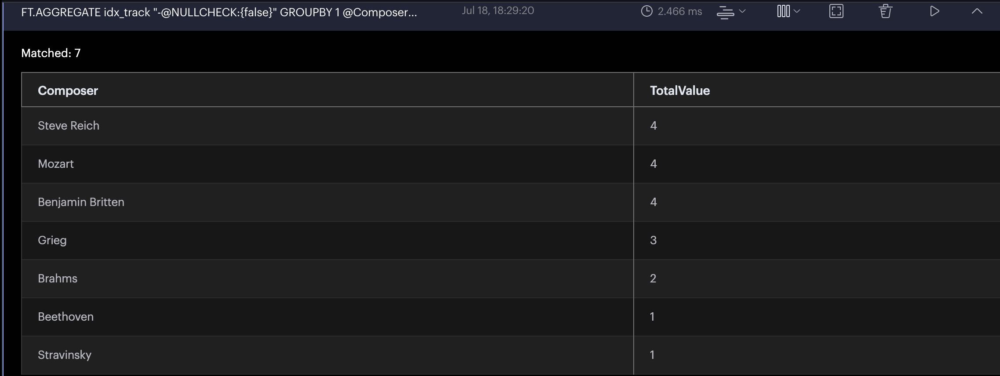
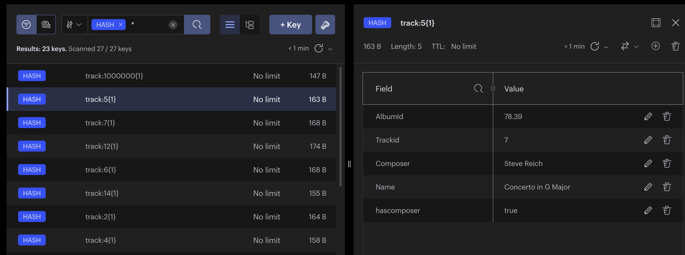
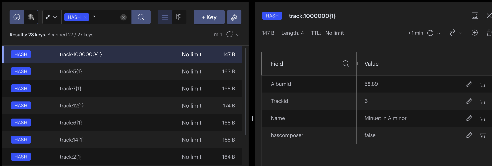

Currently 2023-07-18 it is not possible to filter by missing values in RediSearch

This means you must add a flag to your data HASH or JSON objects in Redis

The following LUA Scripts and Search Index Definition and Query demonstrate this workaround:

``` 
EVAL "redis.call('SADD','trackids'..KEYS[1],'1','2','3','4','5','6','7','8','9') redis.call('SADD','composers'..KEYS[1],'','Mozart','Beethoven','Brahms','Stravinsky','Grieg','Steve Reich','Benjamin Britten') redis.call('SADD','comptypes'..KEYS[1],'Minuet','Concerto','Piano Trio','Duet','String Quartet','Symphony') redis.call('SADD','musickeys'..KEYS[1],'C Major','A minor','F#','G Major')" 1 {1}

EVAL "for index=1,ARGV[1] do  local composer = redis.call('SRANDMEMBER','composers'..KEYS[1]) local hascomposer = 'true' if composer == '' then hascomposer = 'false' end redis.call('HSET','track:'..index..KEYS[1],'AlbumId',''..redis.call('SRANDMEMBER','trackids'..KEYS[1])..''..redis.call('SRANDMEMBER','trackids'..KEYS[1]),'AlbumId',''..redis.call('SRANDMEMBER','trackids'..KEYS[1])..''..redis.call('SRANDMEMBER','trackids'..KEYS[1])..'.'..redis.call('SRANDMEMBER','trackids'..KEYS[1])..'9','Trackid',redis.call('SRANDMEMBER','trackids'..KEYS[1]),'Composer',composer,'Name',redis.call('SRANDMEMBER','comptypes'..KEYS[1])..' in '..redis.call('SRANDMEMBER','musickeys'..KEYS[1]),'hascomposer',hascomposer) end return 'created '..ARGV[1]..' Compositions'" 1 {1} 20

EVAL "for index=1000000,1000000+ARGV[1] do redis.call('HSET','track:'..index..KEYS[1],'AlbumId',''..redis.call('SRANDMEMBER','trackids'..KEYS[1])..''..redis.call('SRANDMEMBER','trackids'..KEYS[1]),'AlbumId',''..redis.call('SRANDMEMBER','trackids'..KEYS[1])..''..redis.call('SRANDMEMBER','trackids'..KEYS[1])..'.'..redis.call('SRANDMEMBER','trackids'..KEYS[1])..'9','Trackid',redis.call('SRANDMEMBER','trackids'..KEYS[1]),'Name',redis.call('SRANDMEMBER','comptypes'..KEYS[1])..' in '..redis.call('SRANDMEMBER','musickeys'..KEYS[1]),'hascomposer','false') end return 'created '..ARGV[1]..' Compositions'" 1 {1} 2

FT.CREATE idx_track PREFIX 1 track: SCHEMA TrackId NUMERIC Name TEXT PHONETIC dm:en AlbumId NUMERIC SORTABLE Composer TEXT PHONETIC dm:en UnitPrice NUMERIC SORTABLE hascomposer AS NULLCHECK TAG 
FT.AGGREGATE idx_track "-@NULLCHECK:{false}" GROUPBY 1 @Composer  REDUCE COUNT 0 AS TotalValue SORTBY 2 @TotalValue DESC
```






